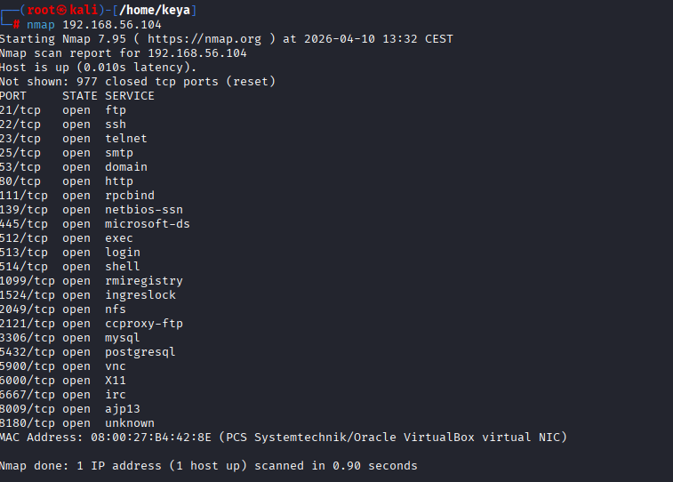
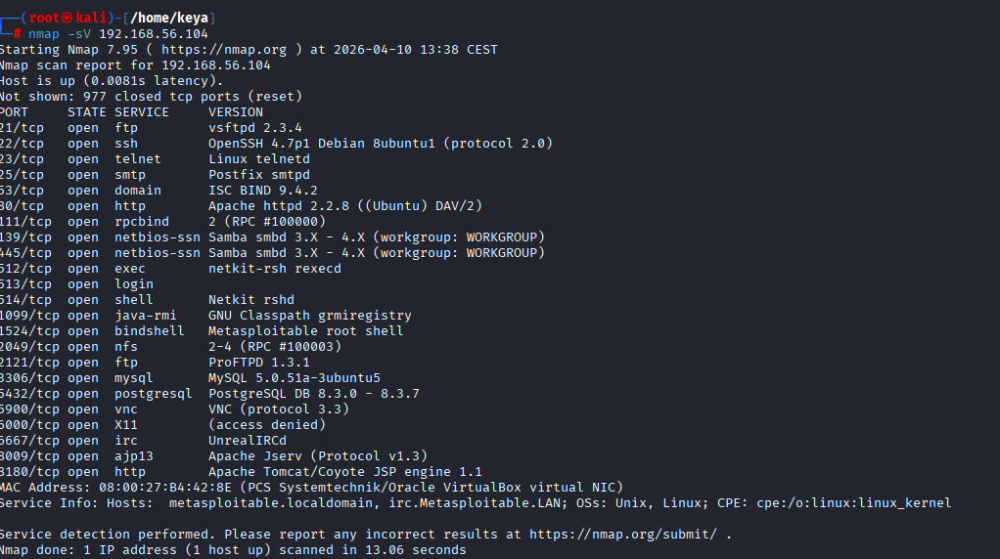
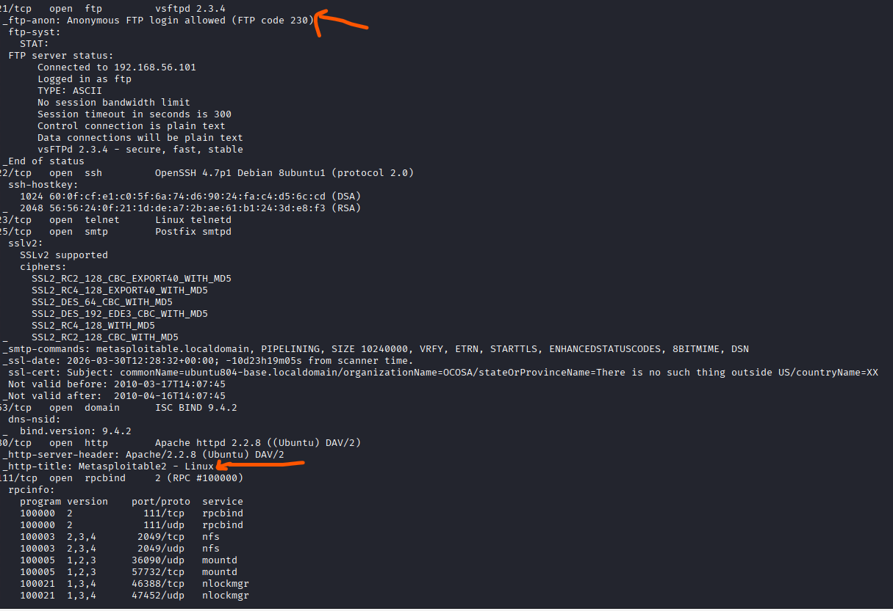
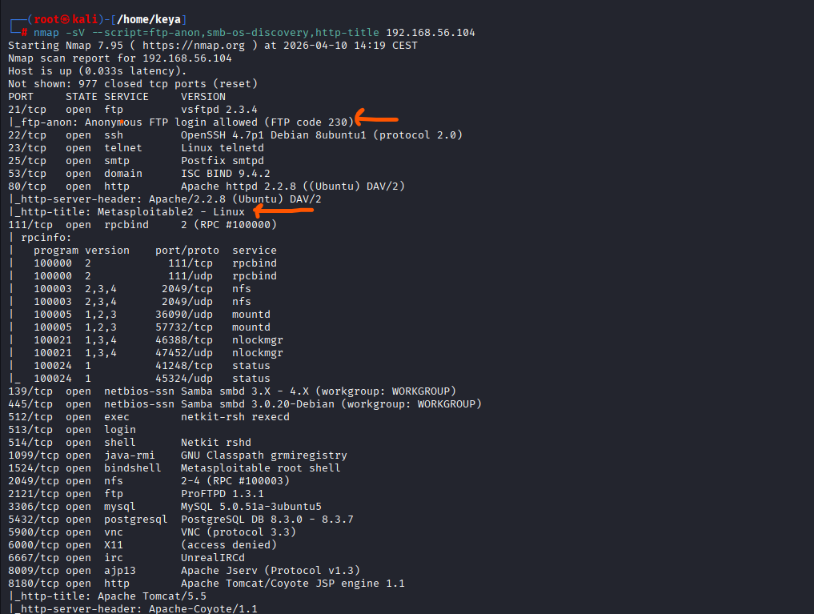

# 🔐 Kali Linux Enumeration & Nmap Scanning Lab

## 📌 Project Overview

This project demonstrates a hands-on cybersecurity lab where I performed network discovery, enumeration, and vulnerability analysis using Kali Linux and Nmap.

---

## 🛠️ Tools Used

* Kali Linux
* Nmap
* Metasploitable2
* Netdiscover

---

## 🌐 Lab Setup

* Attacker: Kali Linux
* Target: Metasploitable2
* Network: Host-only (isolated lab)

---

## 🔍 Steps Performed

### 1. Network Discovery

Used netdiscover to find live hosts.

### 2. Nmap Basic Scan

Identified open ports and services.

### 3. Service Enumeration

Detected service versions using `-sV`.

### 4. Aggressive Scan

Performed deep scan using `-A`.

### 5. Targeted Enumeration

Used NSE scripts for focused analysis.

---

## 📸 Screenshots

## 📸 Screenshots

### 1. Nmap Basic Scan

### 2. Service Version Detection

### 3. Aggressive Scan

### 4. Targeted Enumeration
.

---

## ⚠️ Key Findings

* Multiple open ports (FTP, SSH, HTTP, SMB)
* Outdated services (vsftpd, Apache)
* Anonymous FTP access enabled

---

## 🧠 Learning Outcome

* Understood enumeration process
* Learned Nmap scanning techniques
* Identified vulnerabilities in lab environment

---

## 🚀 Conclusion

This project helped me understand how attackers enumerate systems and identify vulnerabilities in real-world scenarios.
